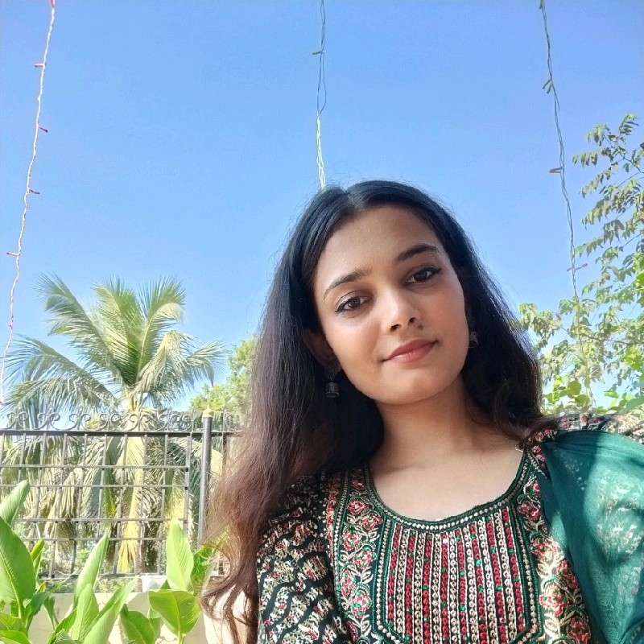

# N Queens Puzzle

## Overview

This is a C++ implementation of the N Queens Puzzle using the SDL (Simple DirectMedia Layer) library for graphics rendering.

The N Queens Puzzle is a classic problem of placing N chess queens on an 4*4 chessboard so that no two queens threaten each other.

## Prerequisites

- C++ compiler
- SDL2 library (installation instructions can be found [here](https://wiki.libsdl.org/Installation))

## Getting Started

1. Clone this repository:

   ```sh
   git clone https://github.com/f0rsakeN-afk/4-queen-puzzle
   ```

2. For SDL one compile the source code by navigating to src directory:

   ```sh
   make
   ```

3. Run the executable:

   ```sh
   ./app
   ```

## Usage

- Left-click: Place a white queen on the chessboard.
- Right-click: Place a black queen on the chessboard.

## Contributors
<div style="display: flex; justify-content: center;">
  <!-- Priya Mishra -->
  <div style="text-align: center; margin-right: 20px;">
    <a href="https://github.com/contributor2">
      
    </a>
    <br>
    <a href="https://github.com/contributor2">Priya Mishra</a>
  </div>

  <!-- Suraj Singh -->
  <div style="text-align: center; margin-right: 20px;">
    <a href="https://github.com/h0miez4evr">
      
    </a>
    <br>
    <a href="https://github.com/h0miez4evr">Suraj Singh</a>
  </div>

  <!-- Ramesh Mahato -->
  <div style="text-align: center; margin-right: 20px;">
    <a href="https://github.com/contributor2">
      
    </a>
    <br>
    <a href="https://github.com/contributor2">Ramesh Mahato</a>
  </div>

  <!-- Naresh Rajbanshi -->
  <div style="text-align: center;">
    <a href="https://github.com/f0rsakeN-afk">
      
    </a>
    <br>
    <a href="https://github.com/f0rsakeN-afk">Naresh Rajbanshi</a>
  </div>
</div>


## License

This project is licensed under the [MIT License](LICENSE).
